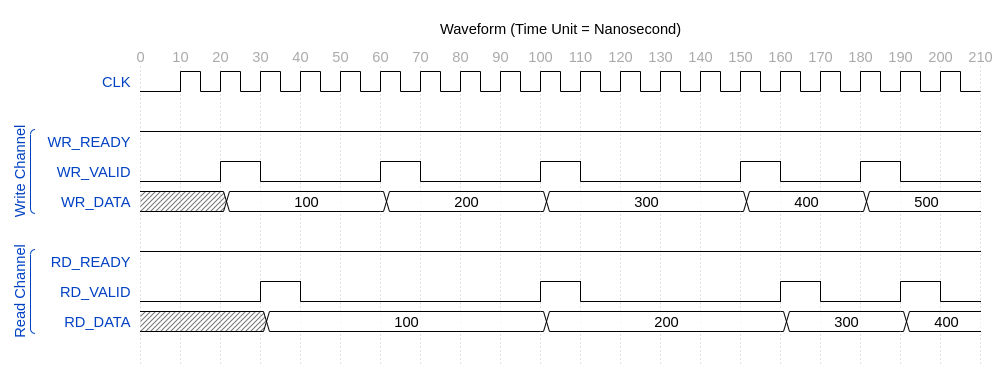

# WaveReplay

_WaveReplay_ is a DSL/library in Scala for debugging waveforms

## Table of Contents

- [WaveReplay](#project-name)
- [Table of Contents](#table-of-contents)
- [Usage](#usage)
    - [Publish Library Locally](#publish-library-locally)
    - [Use Local Library in Another Project](#use-local-library-in-another-project)
- [Tutorials](#tutorials)
    - [Example Design and Waveform](#example-design-and-waveform)
    - [Tutorial 1 Capturing Waveform](#tutorial-1-capturing-waveform)

## Usage

### Publish Library Locally

```bash
# Clone this repository
git clone https://github.com/gednyengs/wavereplay.git

# Navigate to the project directory
cd wavereplay

# Publish the library to locally
sbt publishLocal
```

### Use Local Library in Another Project

- Assume the following directory structure for the project ___my-app___
```
my-app/
├── build.sbt
└── src/
└── main/
    └── scala/
        └── com/
            └── example/
                └── MyApp.scala

```
- Add the locally-published ___wavereplay___ library to _my-app's_ `build.sbt` file as follows
```scala
ThisBuild / organization    := "com.example"
ThisBuild / version         := "1.0.0"
ThisBuild / scalaVersion    := "2.13.14"

lazy val root = (project in file("."))
.settings(
    name := "my-app",
    libraryDependencies ++= Seq(
        "com.sekekama" %% "wavereplay" % "1.0.0"
    )
)
```
- Use wavereplay in `src/main/scala/my/app/MyApp.scala`
```scala
package com
package example

import com.sekekama.wavereplay._

object Main extends App {

// Create waveform and wrap it with cursors
val wvfm_data : Map[String, List[WaveEntry]] = Map(
        "SignalA" -> List((0, 10), (10, 25), (20, -50), (30, -100), (40, 500))
    )
val wvfm = CursoredWaveform(DictWaveform(0, 40, 10, wvfm_data))

// Create references for signals of interest
val sigA = wvfm("SignalA")

// Create proposition to find all negative values of SignalA and print them
val neg_vals_prop = (sigA < 0) at "t" exec {
    println("Captured value = " + sigA.At("t"))
}

// Replay the waveform with the specified proposition
Replay(neg_vals_prop, wvfm)
}
```
- Run ___my-app___
```bash
sbt run
```

## Tutorials

### Example Design and Waveform

The following examples assume we have a simple _FIFO_ with one _WRITE_ interface and one _READ_ interface.

The waveform associated with the design during debugging is shown below:


### Tutorial 1 Capturing Waveform

- Before using _WaveReplay_ to analyze a waveform, we need to capture the waveform data in a form that _WaveReplay_ can understand
- _WaveReplay_ provides a utility class named ___DictWaveform___ that represents a _Waveform_ based on a dictionary
    - Every signal in the waveform is represented by its _path name_ and a list of its _value-change entries_
- Let's create the following file `src/main/scala/my/app/WaveformData.scala`
```scala
package com
package example

import com.sekekama.wavereplay._

object WaveformData {

    // Create waveform data
    // Note:
    // - Signal values are provided in value-change format.
    //   This means we specify only those instances where data changes from its
    //   previous value
    //

    // Value-change for CLK signal
    val clk_data: List[WaveEntry] = List(
        (0,  0),
        (10, 1), (15, 0), (20, 1), (25, 0), (30, 1), (35, 0), (40, 1), (45, 0),
        (50, 1), (55, 0), (60, 1), (65, 0), (70, 1), (75, 0), (80, 1), (85, 0),
        (90, 1), (95, 0), (100, 1), (105, 0), (110, 1), (115, 0), (120, 1), (125, 0),
        (130, 1), (135, 0), (140, 1), (145, 0), (150, 1), (155, 0), (160, 1), (165, 0),
        (170, 1), (175, 0), (180, 1), (185, 0), (190, 1), (195, 0), (200, 1), (205, 0)
    )

    // Value-change for WR_READY signal
    val wr_ready_data: List[WaveEntry] = List((0,1))

    // Value-change for WR_VALID signal
    val wr_valid_data: List[WaveEntry] = List(
        (0, 0), (20, 1), (30, 0), (60, 1), (70, 0), (100, 1), (110, 0),
        (150, 1), (160, 0), (180, 1), (190, 0)
    )

    // Value-change for WR_DATA signal
    val wr_data_data: List[WaveEntry] = List(
        (0, 0), (20, 100), (60, 200), (100, 300), (150, 400), (180, 500)
    )

    // Value-change for RD_READY signal
    val rd_ready_data: List[WaveEntry] = List((0,1))

    // Value-change for RD_VALID signal
    val rd_valid_data: List[WaveEntry] = List(
        (0, 0), (30, 1), (40, 0), (100, 1), (110, 0), (160, 1), (170, 0), (190, 1), (200, 0)
    )

    // Value-change for RD_DATA signal
    val rd_data_data: List[WaveEntry] = List(
        (0, 0), (30, 100), (100, 200), (160, 300), (190, 400)
    )

    // Map of signal names to their respective value-change data
    val wvfm_data = Map(
        "CLK"       -> clk_data,
        "WR_READY"  -> wr_ready_data,
        "WR_VALID"  -> wr_valid_data,
        "WR_DATA"   -> wr_data_data,
        "RD_READY"  -> rd_ready_data,
        "RD_VALID"  -> rd_valid_data,
        "RD_DATA"   -> rd_data_data
    )

    // Waveform
    //
    // Note: we use the CursoredWaveform wrapper to enable using time cursors
    val wvfm = CursoredWaveform(DictWaveform(0, 210, 10, wvfm_data))

    // Create signal references so we can use them in expressions
    val clk         = wvfm("CLK")
    val wr_ready    = wvfm("WR_READY")
    val wr_valid    = wvfm("WR_VALID")
    val wr_data     = wvfm("WR_DATA")
    val rd_ready    = wvfm("RD_READY")
    val rd_valid    = wvfm("RD_VALID")
    val rd_data     = wvfm("RD_DATA")
}
```
- Create simple code that reads values of different signals at given times
    - In `src/main/scala/my/app/MyApp.scala`
```scala
package com
package example

import com.sekekama.wavereplay._

object Main extends App {

    // Get waveform and signal references
    import WaveformData._

    // Get signal values at different time stamps
    println(s"WR_DATA @ 30ns = " + wr_data.At(30))
    println(s"RD_DATA @ 160ns = " + rd_data.At(160))
}
```
- Run with `sbt run`. We should get the following output
```bash
WR_DATA @ 30ns = 100
RD_DATA @ 160ns = 300
```
